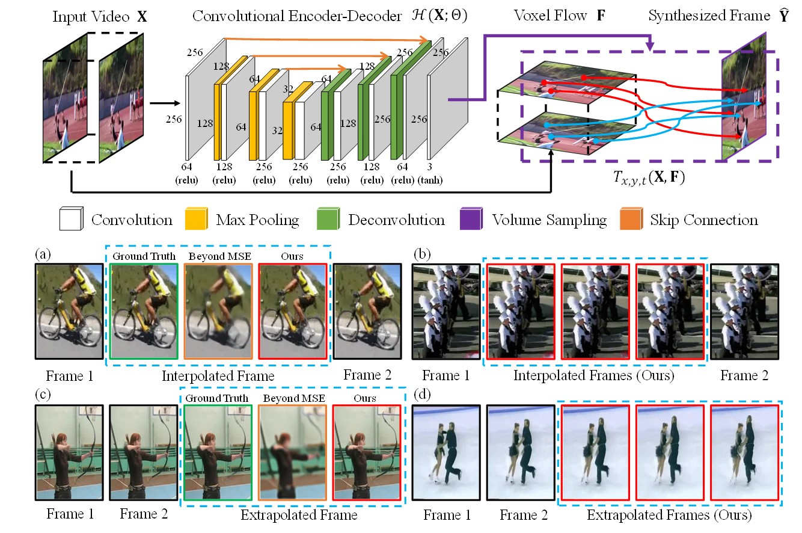

# Video Frame Synthesis using Deep Voxel Flow
We address the problem of synthesizing new video frames in an existing video, either in-between existing frames (interpolation), or subsequent to them (extrapolation). Our method requires no human supervision, and any video can be used as training data by dropping, and then learning to predict, existing frames. `Deep Voxel Flow (DVF)` is efficient, and can be applied at any video resolution. We demonstrate that our method produces results that both quantitatively and qualitatively improve upon the state-of-the-art.

**_Note: we encourage you to check out the newly released [pytorch-voxel-flow](https://github.com/lxx1991/pytorch-voxel-flow). Please contact Dr. Xiaoxiao Li (lxx1991@gmail.com) for the [pre-trained models](https://drive.google.com/file/d/1FB-mpS4UokiLriDBNJSBmozMQRH0Qez1/view) of "Deep Voxel Flow"._**

[[Project]](https://liuziwei7.github.io/projects/VoxelFlow) [[Paper]](https://arxiv.org/abs/1702.02463) [[Demo]](https://liuziwei7.github.io/projects/voxelflow/demo.html)      


## Other Implementations
* [tensorflow-voxel-flow](https://git.sesse.net/?p=voxel-flow)
* [pytorch-voxel-flow](https://github.com/lxx1991/pytorch-voxel-flow) 

## Overview
`Deep Voxel Flow (DVF)` is the author's re-implementation of the video frame synthesizer described in:  
"Video Frame Synthesis using Deep Voxel Flow"   
[Ziwei Liu](https://liuziwei7.github.io/), [Raymond A. Yeh](http://www.isle.illinois.edu/~yeh17/), [Xiaoou Tang](http://www.ie.cuhk.edu.hk/people/xotang.shtml), [Yiming Liu](http://bitstream9.me/), [Aseem Agarwala](http://www.agarwala.org/) (CUHK & UIUC & Google Research)
in International Conference on Computer Vision (ICCV) 2017, Oral Presentation



Further information please contact [Ziwei Liu](https://liuziwei7.github.io/).

## Requirements
* [TensorFlow](https://www.tensorflow.org/)

## Data Preparation
* [Train/Test Split](https://drive.google.com/open?id=1rwnTfzCEIMFv6xiBGCpSnCUvMufJXdkU)
* Training Data: extract frame triplets from `UCF101` with obvious motion.
* [Testing Data](https://drive.google.com/open?id=0B7EVK8r0v71pdHBNdXB6TE1wSTQ)
* [Motion Masks](https://drive.google.com/open?id=1Uc7ZPsiPf-ViuZusdmz5D4P8E5VewhH6)

## Getting started
* Run the training script:
``` bash
python voxel_flow_train.py --subset=train
```
* Run the testing script:
``` bash
python voxel_flow_train.py --subset=test
```
* Run the evaluation script:
``` bash
matlab eval_voxelflow.m
```

## License and Citation
The use of this software is RESTRICTED to **non-commercial research and educational purposes**.

```
@inproceedings{liu2017voxelflow,
 author = {Ziwei Liu, Raymond Yeh, Xiaoou Tang, Yiming Liu, and Aseem Agarwala},
 title = {Video Frame Synthesis using Deep Voxel Flow},
 booktitle = {Proceedings of International Conference on Computer Vision (ICCV)},
 month = {October},
 year = {2017} 
}
```

## Disclaimer
This is not an official Google product.
